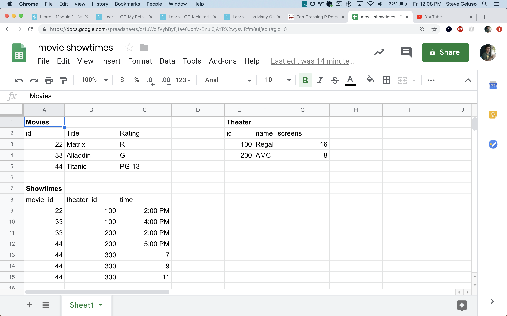

### Manually Picking Off Properties
Before we used the other instance method `self.showings` we used `.each` to
manually iterate over `Showing.all`, used an if statement to check which ones
matches and manually shovelled the property we wanted in to the results array.

`.select` is good at picking entire array elements out of an array. It is not
good at picking off specific parts of elements in an array.

### Other

